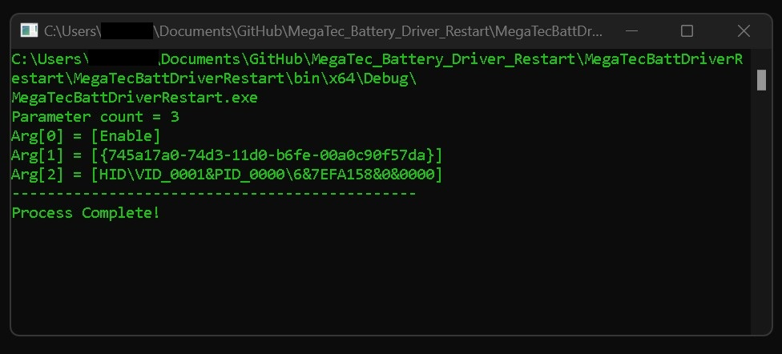

# MegaTec Battery Driver Restart

This application was made for the old **MegaTec UPS** devices that use the *UPSilion* software.

Using Windows 11 with the UPSilion software works however every time the PC boots up 
you will get an error "The UPS device has been disconected"

Now if you toggle the driver enable/disable in the `computer managment` > `Device Manager` > `HID-compliant` device *VID_0001* & *PID_0000*

The UPS will connect again, and this must be done everytime you boot up.

Since the pc asks to restart after changing the device enable/disable

you will get an error if running it more than once without restarting
